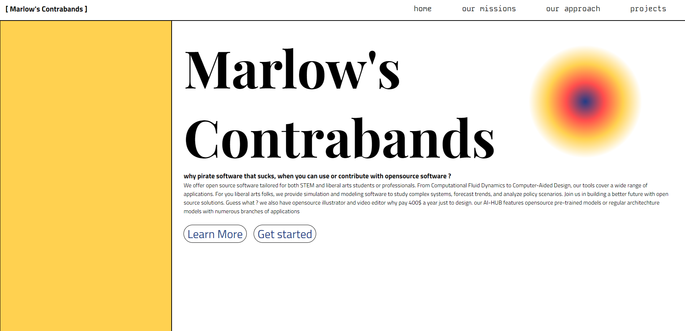
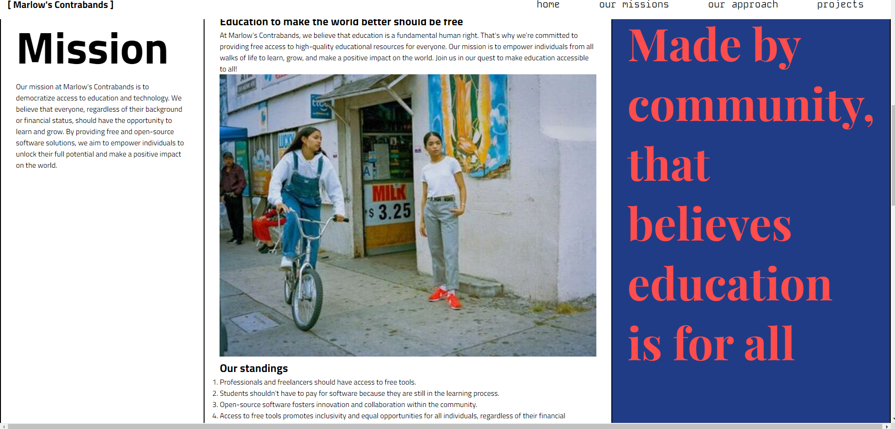
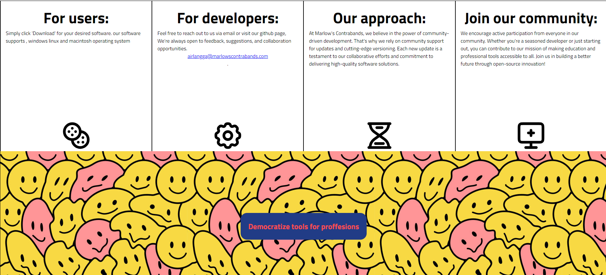
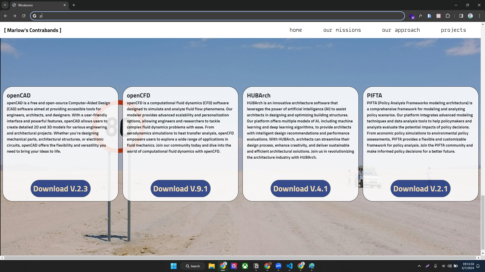
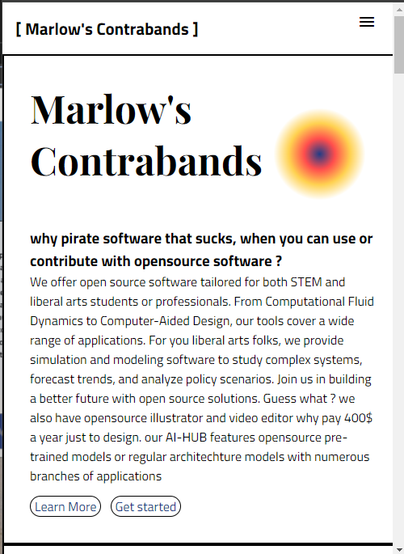
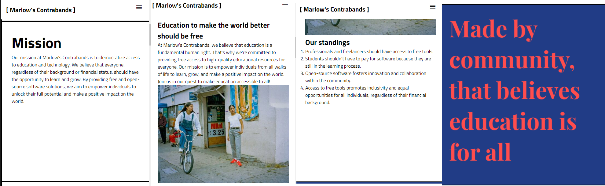
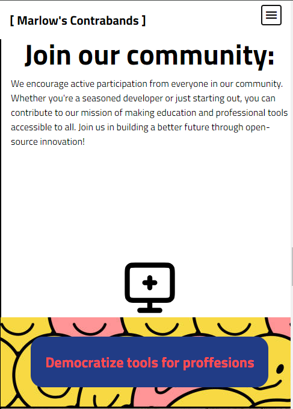
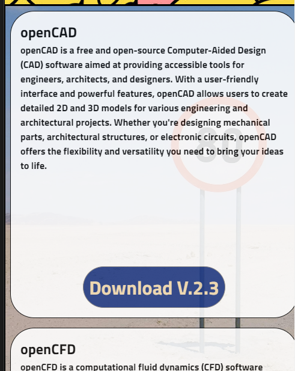
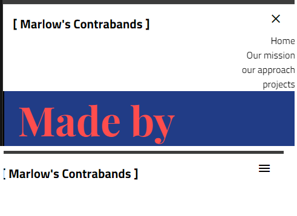

## Marlows contraband 

### Description

This project is a web application built using HTML, CSS, and JavaScript. It serves as a template for creating a documentation website. The website includes information about the project, instructions for setup and usage, and showcases screenshots of the development process.

Marlows contraband is a website dedicated to be the hub for opensource tools, From graphic designing to Fluid modeling. Marlows contraband offers various software for free, we also encourage people to make their own plugin and upload it to the community plugin libraries 


### Setup Instructions

To set up the project locally, follow these steps:

1. Clone the repository to your local machine.
2. Open the project folder in your code editor.
3. Open the `index.html` file in your web browser to view the website.

### Screenshots

### Landing Page

Landing page used for USER to get first impression. 



### Mission Page

mission page used for user to know what kind of corporation marlows contraband is 



### Approach Page

approach page used for user to understand how is it possible marlows contraband run their business



### Project Page

project page is the current prokect that are handled by marlows contraband 



### Landing Page (Phone View)


### Mission Page (Phone View)


### Approach Page (Phone View)


### Project Page (Phone View)


### Burger Navigation



### Dependencies

This project does not have any external dependencies or libraries. It is built using pure HTML, CSS, and JavaScript.

### Design Choices

- **Responsive Design**: The website is designed to be responsive and accessible on different devices and screen sizes.
- **Consistent Styling**: Consistent styling elements are used throughout the website to maintain visual coherence.

### Contribution

Contributions to this project are welcome. If you find any issues or have suggestions for improvements, please open an issue or submit a pull request on GitHub.

For any inquiries or questions about the project, feel free to contact the author at [wcks@marlowcontraband.com](mailto:wcks@marlowcontraband.com).

1. Fork the repository.
2. Create a new branch (`git checkout -b plugin-feature`).
3. Make changes and commit them (`git commit -am 'Add plugin feature'`). 
4. Push to the branch (`git push origin plugin-feature`).
5. Create a pull request.

If you want to contribute to the website, here's how:

1. Fork the website repository.
2. Create a new branch (`git checkout -b website-feature`).
3. Make changes and commit them (`git commit -am 'Add website feature'`).
4. Push to the branch (`git push origin website-feature`).
5. Create a pull request.

These steps ensure that your contributions can be reviewed and integrated into the main repositories effectively.


### License

This project is licensed under the MIT License. See the [LICENSE](LICENSE) file for details.

### Author

[wicaksono](https://github.com/wicaksonolxn)

### Contact

## License

Include information about the license for your project. Choose an appropriate license and include any required disclaimers.

This project is licensed under the [MIT License]("./LICENSE").
```

Feel free to customize this template to fit the specific needs of your project. Let me know if you need further assistance! 
```
to visit our current website please visit 
[marlows yard website](https://software.marlowsyards.shop/ )